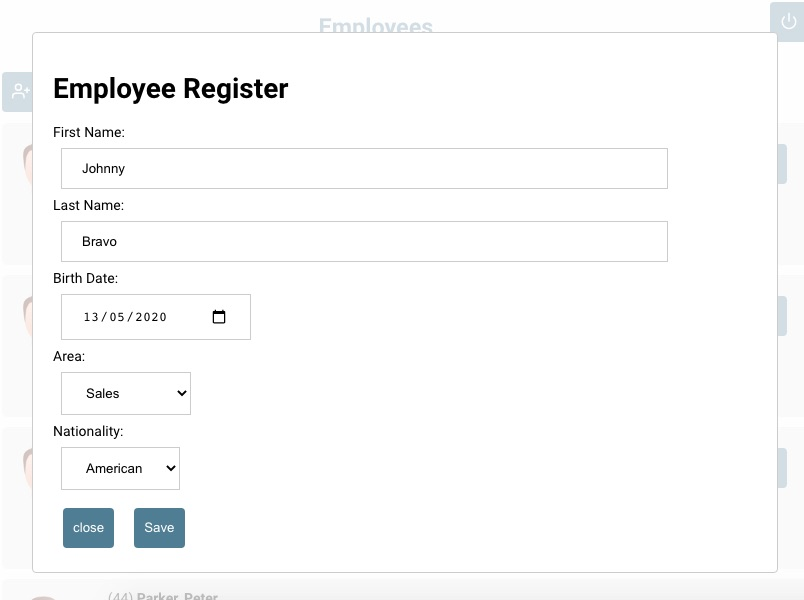

# employee

  
  

About Employee Registration

This is a project developed with NodeJS and MySQL in the backend, ReactJS in the frontend and React Native in Mobile side.

## Technologies

- Node
- React
- React native
- Mysql

## Project to practice some functions like:

- JWT authentication
- Password cripto with Bcrypt
- Mobile Login with token
- Routes
- Front End functions in General and others.

